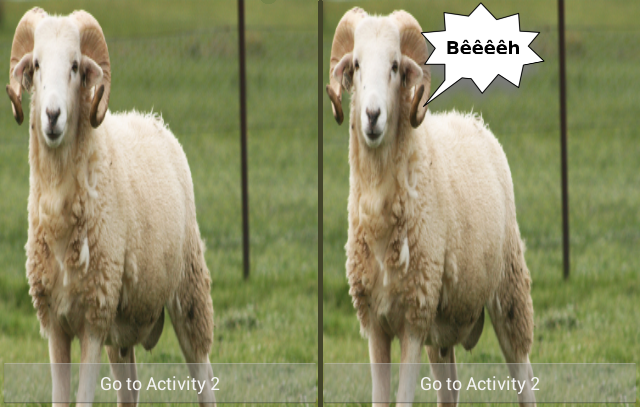
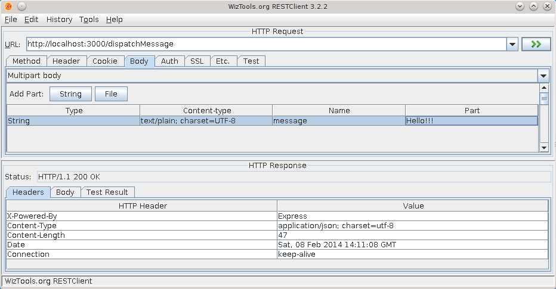

# Android Websocket Example

A sample application that keeps a permanent WebSocket connection in an Android bound Service.
When a message is received from the websocket, an event is sent using LocalBroadcastManager.
It handles network configuration changes using a receiver to stop/start the websocket depending on the network state.

The sheep in the current activity will start to bleat when a message is received from the websocket.




## Try it

- First, use NodeJS to launch the server:

```bash
$ npm install
$ node main
```

- You can then access the websocket through:

```
http://localhost:3000/ws/
```

- Then, modify the `com.nilhcem.websockets.WebSocketsService.WS_URL` constant to specify the server IP:

```
private static final String WS_URL = "ws://SERVER_IP:3000/ws/websocket";
```

- Compile, deploy and run the application

```bash
$ ./gradlew clean installDebug
```

- Finally, send a POST request to ```http://SERVER_IP:3000/dispatchMessage```, the websocket will send the message to the connected clients.
You can use the awesome [rest-client](https://github.com/wiztools/rest-client) tool to assist you in this task.



- If the sheep bleats, that's a success (note: you can see the received message in the device logs)

# Acknowledgements

- [NodeJS Sample Server](https://github.com/MartinMoizard/Realtime-samples)
- [Android Websocket Library](https://github.com/codebutler/android-websockets/)
